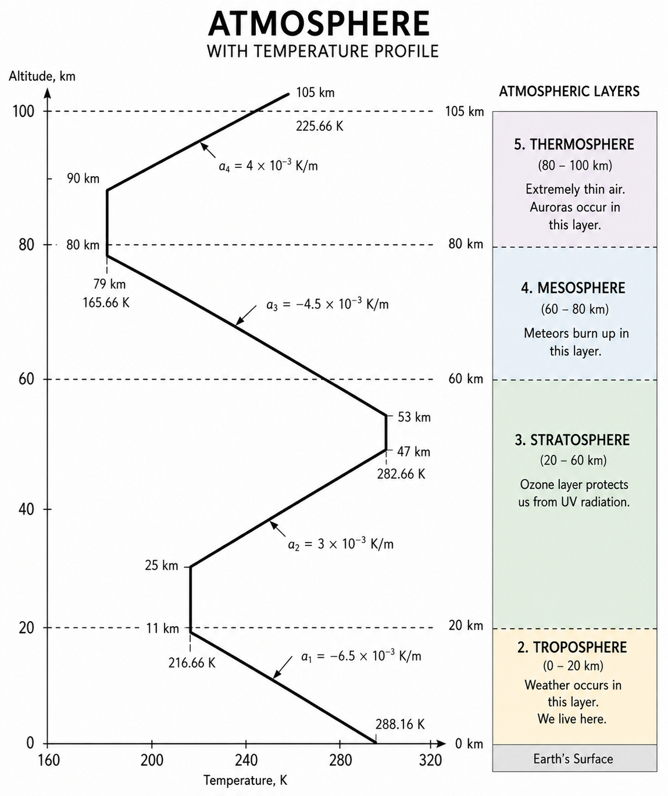

# Fundamentals of Aerodynamics

Aerodynamics is the study of motion of air and how thermodynamic properties changes as an object is being subjected to a moving air. Air is made up of


## Properties of Air
Pressure Temperature and Density

The particle card shows how temperature, density, and pressure relate in a simplified ideal-gas model. Particle speed follows the square root of temperature, while the animation provides a visual model of moving gas particles.

```particle-card
{
  "title": "Temperature, Mass, Volume, and Pressure",
  "subtitle": "Adjust temperature, mass, and volume to observe ideal-gas behavior.",
  "model": "ideal-gas",
  "particleCount": 36,
  "gas": {
    "R": 287,
    "unit": "J/(kg·K)"
  },
  "temperature": {
    "value": 288.15,
    "min": 100,
    "max": 900,
    "step": 1,
    "unit": "K"
  },
  "mass": {
    "value": 1.225,
    "min": 0.1,
    "max": 5,
    "step": 0.01,
    "unit": "kg"
  },
  "volume": {
    "value": 1,
    "min": 0.1,
    "max": 5,
    "step": 0.01,
    "unit": "m^3"
  },
  "notes": [
    "Increasing temperature increases pressure when mass and volume remain constant.",
    "Increasing mass increases density and pressure.",
    "Increasing volume decreases density and pressure."
  ]
}
```

Assumptions when dealing with aerodynamic problems involves
### Incompressibility
This implies a condition where density is constant along the flow field.

(Put a compressibility MAP or range)

### Inviscid
Inviscid Implies a condition where 
### Adiabatic 
### Isentropic

## Geopotential and Geomtric Altitude

$$g = g_0\left[\frac{r}{h_a}\right]^2$$

where 

$$h_a = r + h_G$$

Therefore

$$g = g_0\left[\frac{r}{ r + h_G}\right]^2$$

Example: Problem Solving


## Atmosphere
Atmosphere is Divided into Several Layers 


### Isentropic Layers

$$\frac{P}{P_0} = \left[\frac{T}{T_0}\right]^{\frac{\gamma}{\gamma-1}}$$
$$T = T_0 + ah$$
$$ \frac{P}{P_0} = \left[1 + \frac{ah}{T_0} \right]^{5.26}$$
$$ \frac{\rho}{\rho_0} = \left[1 + \frac{ah}{T_0} \right]^{4.26}$$
### Isothermal Layers
$$P = $$

## Conservation of Mass, Energy and Momentum


Images are rendered responsively and include alternative text for accessibility.

$$\rho_1 A_1 V_1 = \rho_2 A_2 V_1$$

For Incompressible assumption we assume that 

$$\rho_1 = \rho_2$$

Thus

$$A_1 V_1 =  A_2 V_2$$


```equation-card
{
  "title": "Continuity Equation",
  "subtitle": "Observe how fluid speed changes through a duct.",
  "equation": "A_1 V_1 = A_2 V_2",
  "behavior": { "activeVariables": ["A_1", "V_2"] },
  "variables": [
    { "symbol": "A_1", "name": "Inlet Area", "unit": "m^2", "axis": "left", "value": 5.8, "min": 1, "max": 10, "step": 0.1, "interactive": true },
    { "symbol": "A_2", "name": "Outlet Area", "unit": "m^2", "axis": "left", "value": 5.8, "min": 1, "max": 10, "step": 0.1, "interactive": true },
    { "symbol": "V_1", "name": "Inlet Velocity", "unit": "m/s", "axis": "right", "value": 29.2, "min": 2, "max": 50, "step": 0.2, "interactive": true },
    { "symbol": "V_2", "name": "Outlet Velocity", "unit": "m/s", "axis": "right", "value": 29.2, "min": 2, "max": 50, "step": 0.2, "interactive": true }
  ],
  "graph": {
    "type": "duct-particle",
    "relationship": { "left": "A_1 * V_1", "right": "A_2 * V_2" },
    "axes": { "left": { "label": "Area", "unit": "m^2" }, "right": { "label": "Velocity", "unit": "m/s" } },
    "particles": { "count": 24, "speedScale": 1, "showTrails": true, "showVectors": true }
  },
  "notes": ["The windows are synchronized conceptual samples of flow at the inlet and outlet."]
}
```

\\
### Example 1: A plane is flying at a given altitude
Determine the required velocity.
### Solution:
$$A + B = C$$
asdsadad
### Answer:
$$C = 3$$
asdsadasd
\\

## Mach Number and Speed of Sound
___

Sound Travels through a medium by creating wavs. The medium in this case would be air. The Speed of Sound can then be thought of the Speed of Disturbance on the medium. Since this disturbance highly dependent on a medium in which the medium itself have thermodynamic properties which vairies in this case air with altitude. It can be expressed as:
$$a^2 = \left(\frac{\partial p}{\partial\rho}\right)_s$$
The propagation of time occurs so quickly that there is no occurence of heat transfer. Therefore we assume that the process is isentropic

$$a^2 = \gamma RT$$
$$ M = \frac{V}{a^2}$$


## Compressibility Effect on Stagnation
$$c_pT_\infin + \frac{V^2_\infin}{2} =c_pT + \frac{V^2}{2} $$
$$\frac{P}{P_0}=\left[\frac{T}{T_0}\right]^\frac{\gamma}{\gamma-1} = \left[\frac{\rho}{\rho_0}\right]^{\gamma} $$
## Viscous Effects
$$\mu = \nu\rho$$

$$\mu_\infin = \mu_0 \left[\frac{T^{3/2}}{T_0 ^{3/2}}\right]\left[\frac{T_0 + S}{T + S}\right]$$

## Flat Plate Theory
### Laminar Flow
$$C_f = \frac{1.328}{\sqrt{Re_L}} , $$
$$\delta = \frac{5.2x}{\sqrt{Re_x}}$$

### Turbulent Flow
$$C_f = \frac{0.074}{{Re_L}^{0.2}}$$
$$\delta = \frac{0.37x}{Re_x^{}0.2} $$

## Coeffecient of Pressure

$$C_p = \frac{P_1 - P_\infin}{\frac{1}{2} \rho V^2}$$
$$C_p = \frac{C_{p0}}{\sqrt{1-M^2}}$$

### Cp Distribution on Subsonic to Supersonic
### Cp Distribution During Stall

### Lift form Cp Distribution

$$\frac{1}{c}\int_{p_{upper}}^{p_{lower}} (C_{p,l} - C_{p,u})\,dx$$

## Critical Pressure and Velocity

## Lift Due to Circulation
## Airfoil and Wing


# Applied Aerodynamics

### Steady Aircraft Assumption

### Drag  Polar Equation
$$C_D = C_{D0} + C_{Di}$$
$$ C_{Di} = kC_L^2 $$

## Thrust and Minimum Thrust Required
$$D = T$$
$$\frac{C_L}{C_D}_{max} = \frac{C_L^2}{C_{D0}+kC_L^2}$$
$$C_{D0} = C_{Di}$$

\\
### Example 1: A Plane Weighing 6500 N , Wing Area of $16.2\,\mathrm{m}^{2}$ , WingSpan of 11 m and Osswalt Effeciency of 0.85 having a Velocity of 25 m/s is flying at an altittude of 1000 m. Its Coeffecient of Drag at zero lift condition is 0.03. Find the Thrust Requred of the Aircraft to sustain a steady flight.
### Solution:
$$C_L = \frac{2W}{\rho V^2S}$$
$$ \rho = \rho_1 \left[1+\frac{ah}{T_0}\right]^{4.26}$$
$$\rho = 1.225\, \frac {kg}{m^3}\left[1+\frac{-0.00651 \frac {K}{m} \cdot 1000 \,m}{288.2 \,K}\right]^{4.26}$$
$$\rho = 1.1114  \, \frac{kg}{m^3}$$
We could now Solve for the CL:
$$C_L = \frac{2 \,\cdot6500\,N}{1.1114\,\frac{kg}{m^3}\,\cdot 25^2 \,\frac{m^2}{s^2}\,\cdot\,16.2 \, m^2}$$
$$C_L =1.1553 $$
Solve for CD:
$$C_D = C_{D0} + \frac{C_L^2}{\pi e AR}$$
$$AR = \frac{b^2}{S} = \frac{11^2}{16.2} = 7.469 $$
$$C_D = 0.03 + \frac{1.1553^2}{\pi\cdot0.85\,\cdot 7.469}$$
$$C_D = 0.0969 $$
$$T_R = \frac{W}{C_L/C_D} = \frac{6500}{1.1553/0.0969} $$

### Answer: 
$$T_R = 545.2 \,N$$
We could Also Use The Drag Formula which yields the same answer
$$D = T_R$$
$$T_R = \frac{1}{2}\rho V^2 S C_D$$
$$T_R= \frac{1}{2}\cdot  1.1114  \, \frac{kg}{m^3} \cdot 25^2 m/s \cdot16.2 \,m^2 \cdot 0.0969 = 545.2 \, N$$
\\

### Minimum Thrust Required
$$C_{Di} = C_{D0}$$

## Power and Minimum Power Required

## Excess Power and Rate of Climb
## Time to Climb
## Glide Performance
## Service Ceiling and Absolute Ceiling
## Range And Endurance Propeller Driven Aircraft
## Range And Endurance of Jet Aircraft
## Load Factor

# High Speed Aerodynamics 

### Assumptions

## Normal Shock Wave
## Oblique Shock Wave
## Expansion Fan
## Design Implications
