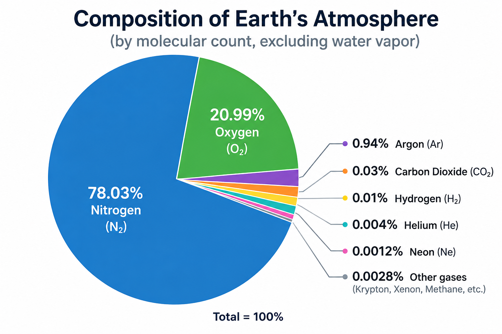
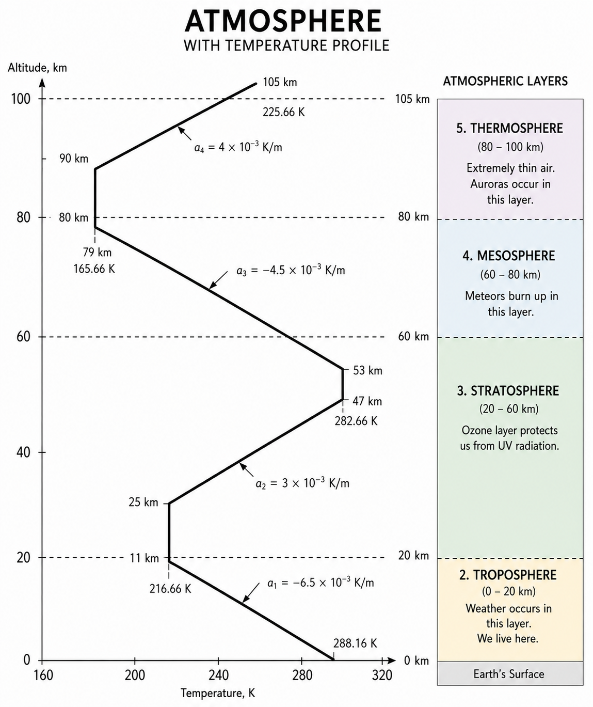

# Fundamentals of Aerodynamics
___

Aerodynamics studies how air moves and how that motion creates forces and moments on an object. For an aircraft, the flow depends on its shape, speed, altitude, and orientation. The same basic ideas also describe flows through ducts, around vehicles, and across control surfaces.

Air is a fluid: it deforms continuously under shear stress. Its aerodynamic behavior is described locally by pressure \(p\), density \(\rho\), temperature \(T\), and velocity \(V\). Changes in these properties produce surface forces. Pressure acts normal to a surface; viscous shear acts tangentially. Integrating the pressure and shear distributions over the aircraft gives the resultant aerodynamic force and moment.



> Aerodynamics is the study of air motion and its interaction with objects. It connects the flow field—pressure, density, temperature, and velocity—to the forces, moments, and performance of an aircraft.

For steady, level flight, the main aerodynamic force components are lift, approximately perpendicular to the relative airflow, and drag, parallel and opposite to it. Their directions are defined relative to the flight path, not necessarily relative to the aircraft body.

## Properties of Air
___

Pressure is normal force per unit area, density is mass per unit volume, and temperature measures the molecular thermal state. Velocity is the bulk-flow speed and direction. Together, these properties specify the local state of the air.

For air modeled as a calorically perfect gas, the equation of state is

$$p=\rho RT,$$

where \(R\approx287.05\ \mathrm{J/(kg\,K)}\). This relation explains why density changes when pressure or temperature changes. For example, at nearly constant pressure, warmer air has lower density.

Dynamic pressure,

$$q=\frac{1}{2}\rho V^2,$$

is a useful measure of the flow's kinetic energy per unit volume. It sets the scale for aerodynamic forces. Reynolds number,

$$Re_L=\frac{\rho V L}{\mu}=\frac{V L}{\nu},$$

compares inertial effects with viscous effects; it helps predict whether a boundary layer is laminar or turbulent. Here \(\mu\) is dynamic viscosity and \(\nu=\mu/\rho\) is kinematic viscosity.

Studying how these properties vary around a body explains the pressure and shear loads on its surface. Those loads are integrated to obtain lift, drag, and pitching moment.

```particle-card
{
  "title": "Temperature, Mass, Volume, and Pressure",
  "subtitle": "Adjust temperature, mass, and volume to observe ideal-gas behavior.",
  "model": "ideal-gas",
  "particleCount": 36,
  "gas": {
    "R": 287,
    "unit": "J/(kg·K)"
  },
  "temperature": {
    "value": 288.15,
    "min": 100,
    "max": 900,
    "step": 1,
    "unit": "K"
  },
  "mass": {
    "value": 1.225,
    "min": 0.1,
    "max": 5,
    "step": 0.01,
    "unit": "kg"
  },
  "volume": {
    "value": 1,
    "min": 0.1,
    "max": 5,
    "step": 0.01,
    "unit": "m^3"
  },
  "notes": [
    "Increasing temperature increases pressure when mass and volume remain constant.",
    "Increasing mass increases density and pressure.",
    "Increasing volume decreases density and pressure."
  ]
}
```

## Geopotential and Geometric Altitude
___

Geometric altitude \(h_g\) is measured from mean sea level. Because gravitational acceleration decreases with distance from Earth's center, standard-atmosphere calculations often use geopotential altitude \(h\), which accounts for that change while keeping a convenient constant-gravity model.

Let \(r\) be Earth's mean radius and \(g_0\) sea-level standard gravity. The absolute distance from Earth's center is \(h_a=r+h_g\), so gravity at geometric altitude is

$$g=g_0\left(\frac{r}{r+h_g}\right)^2.$$

The geopotential altitude corresponding to geometric altitude is

$$h=\frac{r h_g}{r+h_g}.$$

At normal aircraft altitudes the difference is small, but the conversion matters when applying standard-atmosphere layer equations precisely. Use geometric altitude for a physical height above sea level and geopotential altitude for the standard-atmosphere formulas below.

## Atmosphere
___

The standard atmosphere is a reference model that relates altitude to temperature, pressure, and density. It is not a weather forecast; actual atmospheric conditions vary. In the lower atmosphere, the reference model has a constant-temperature-gradient (gradient) layer from sea level to about 11 km, followed by an approximately isothermal layer from 11 km to 25 km.



### Gradient-temperature layer

Let \(T_0,p_0,\rho_0\) denote sea-level reference values and let \(\lambda=dT/dh\) be the layer temperature gradient. In the first layer, \(\lambda\approx-0.0065\ \mathrm{K/m}\), and

$$T=T_0+\lambda h.$$

Combining hydrostatic balance \(dp/dh=-\rho g_0\) with the ideal-gas law gives

$$
\frac{p}{p_0}=\left(\frac{T}{T_0}\right)^{-g_0/(R\lambda)},\qquad
\frac{\rho}{\rho_0}=\left(\frac{T}{T_0}\right)^{-g_0/(R\lambda)-1}.
$$

For the standard lapse rate, the exponents are approximately \(5.256\) for pressure and \(4.256\) for density. Thus, with \(T/T_0=1+\lambda h/T_0\),

$$
\frac{p}{p_0}=\left(1+\frac{\lambda h}{T_0}\right)^{5.256},\qquad
\frac{\rho}{\rho_0}=\left(1+\frac{\lambda h}{T_0}\right)^{4.256}.
$$

These relations apply only within the layer and require consistent altitude and temperature units.

### Isothermal layer

In an isothermal layer, \(T\) is constant. Hydrostatic balance and the ideal-gas law then give exponential pressure and density variation:

$$
\frac{p}{p_{11}}=\exp\left[-\frac{g_0(h-h_{11})}{RT_{11}}\right],\qquad
\frac{\rho}{\rho_{11}}=\exp\left[-\frac{g_0(h-h_{11})}{RT_{11}}\right].
$$

The subscript 11 denotes the values at 11 km. Since \(T\) is constant, \(p/\rho=RT\) remains constant through this layer. For a new gradient layer with nonzero lapse rate, use the general gradient formulas with that layer's base conditions.

## Conservation of Mass, Energy and Momentum
___

Conservation laws connect flow conditions at different locations. For steady one-dimensional flow through a streamtube, mass flow is constant:

$$\dot m=\rho A V,\qquad \rho_1A_1V_1=\rho_2A_2V_2.$$

If density is effectively constant (an incompressible-flow approximation), this reduces to \(A_1V_1=A_2V_2\): a smaller area requires a higher speed.

```equation-card
{
  "title": "Continuity Equation",
  "subtitle": "Observe how fluid speed changes through a duct.",
  "equation": "A_1 * V_1 = A_2 * V_2",
  "behavior": { "activeVariables": ["A_1", "V_2"] },
  "variables": [
    { "symbol": "A_1", "name": "Inlet Area", "unit": "m^2", "axis": "left", "value": 5.8, "min": 1, "max": 10, "step": 0.1, "interactive": true },
    { "symbol": "A_2", "name": "Outlet Area", "unit": "m^2", "axis": "left", "value": 5.8, "min": 1, "max": 10, "step": 0.1, "interactive": true },
    { "symbol": "V_1", "name": "Inlet Velocity", "unit": "m/s", "axis": "right", "value": 29.2, "min": 2, "max": 50, "step": 0.2, "interactive": true },
    { "symbol": "V_2", "name": "Outlet Velocity", "unit": "m/s", "axis": "right", "value": 29.2, "min": 2, "max": 50, "step": 0.2, "interactive": true }
  ],
  "graph": {
    "type": "duct-particle",
    "relationship": { "left": "A_1 * V_1", "right": "A_2 * V_2" },
    "axes": { "left": { "label": "Area", "unit": "m^2" }, "right": { "label": "Velocity", "unit": "m/s" } },
    "particles": { "count": 24, "speedScale": 1, "showTrails": true, "showVectors": true }
  },
  "notes": ["The two windows are conceptual samples of flow at the inlet and outlet."]
}
```

For steady, inviscid, incompressible flow along a streamline, Bernoulli's equation is

$$p+\frac{1}{2}\rho V^2+\rho g z=\text{constant}.$$

At the same elevation this becomes \(p+\tfrac12\rho V^2=\text{constant}\). It is not a general equation for viscous, unsteady, or compressible flows.

For steady, adiabatic flow with negligible shaft work, the energy equation per unit mass is

$$h_t=h+\frac{V^2}{2}=\text{constant},$$

where \(h\) is specific enthalpy and \(h_t\) is stagnation enthalpy. For a perfect gas, \(h=c_pT\), giving \(c_pT+V^2/2=\text{constant}\).

Momentum conservation states that the net force on a control volume equals the rate of momentum change. In one-dimensional steady flow with uniform inlet and outlet profiles, a useful form is

$$\sum F_x=\dot m(V_2-V_1).$$

Pressure forces, wall forces, and weight must be included in the force balance as appropriate.

## Assumptions
___

A model becomes useful when its assumptions are stated. The following approximations answer different questions and should not be treated as interchangeable.

### Incompressibility

Incompressible flow means density is constant along the modeled flow. For air, it is often a reasonable approximation when \(M\lesssim0.3\), though strong heating or other conditions can still change density. It simplifies continuity and Bernoulli relations.

### Inviscid

An inviscid model neglects viscosity and shear stress in the region being analyzed. It can approximate much of the outer flow, but it cannot predict skin-friction drag or boundary-layer separation by itself. Real aircraft have viscous boundary layers at their surfaces.

### Adiabatic

An adiabatic process has no heat transfer across the system boundary. Adiabatic does not by itself mean constant entropy: friction or shocks can generate entropy even when no heat enters.

### Isentropic

An isentropic process is both adiabatic and reversible. It is a useful model for smooth, shock-free compressible flow. Across a shock, stagnation enthalpy is conserved for an adiabatic flow, but entropy rises and stagnation pressure falls; the process is not isentropic.

## Mach Number and Speed of Sound
___

A pressure disturbance travels through a medium at the local speed of sound. For a small disturbance in an isentropic perfect gas,

$$a^2=\left(\frac{\partial p}{\partial\rho}\right)_s=\gamma\frac{p}{\rho}=\gamma RT,\qquad a=\sqrt{\gamma RT},$$

where \(\gamma=c_p/c_v\) (about 1.4 for air near ordinary temperatures). Because \(a\) depends on temperature, it changes with atmospheric conditions.

Mach number compares the flow speed with the local speed of sound:

$$M=\frac{V}{a}.$$

It measures the importance of compressibility. A given true airspeed can correspond to a different Mach number at a different temperature.

## Compressibility Effect on Stagnation
___

Stagnation (total) conditions are the state a flowing parcel would reach if brought to rest isentropically. For steady adiabatic flow of a perfect gas,

$$c_pT+\frac{V^2}{2}=c_pT_t,$$

so the useful temperature relation is

$$\frac{T_t}{T}=1+\frac{\gamma-1}{2}M^2.$$

For isentropic deceleration, pressure and density follow

$$
\frac{p_t}{p}=\left(\frac{T_t}{T}\right)^{\gamma/(\gamma-1)}
=\left[1+\frac{\gamma-1}{2}M^2\right]^{\gamma/(\gamma-1)},
$$

$$
\frac{\rho_t}{\rho}=\left(\frac{T_t}{T}\right)^{1/(\gamma-1)}
=\left[1+\frac{\gamma-1}{2}M^2\right]^{1/(\gamma-1)}.
$$

These are isentropic stagnation relations. A shock causes a loss in stagnation pressure, so the upstream and downstream stagnation pressures are not equal.

## Viscous Effects
___

Viscosity describes a fluid's resistance to shear and creates skin friction and boundary layers. Dynamic and kinematic viscosity are related by

$$\nu=\frac{\mu}{\rho}\qquad\text{or}\qquad\mu=\rho\nu.$$

For air, viscosity increases with temperature. Sutherland's law is a useful approximation:

$$\mu=\mu_0\left(\frac{T}{T_0}\right)^{3/2}\frac{T_0+S}{T+S},$$

where \(S\) is Sutherland's constant (about \(110.4\ \mathrm K\) for air). A boundary layer is the near-wall region where viscous effects matter; its state and possible separation strongly affect drag and lift.

## Flat Plate Theory
___

Flat-plate correlations estimate boundary-layer thickness and skin-friction drag for a smooth plate aligned with a uniform stream. They assume a zero pressure gradient and are approximate; surface roughness, pressure gradients, and transition location change the result. Define the local Reynolds number \(Re_x=\rho Vx/\mu\) and plate Reynolds number \(Re_L=\rho VL/\mu\).

### Laminar Flow

For a laminar, incompressible boundary layer on a smooth flat plate from its leading edge, the Blasius estimates are

$$
C_{f,L}=\frac{1.328}{\sqrt{Re_L}},\qquad
\delta(x)\approx\frac{5x}{\sqrt{Re_x}}.
$$

The first equation is the average skin-friction coefficient over length \(L\), based on one wetted side. The thickness estimate is local and conventionally corresponds to about 99% of freestream velocity.

### Turbulent Flow

For a turbulent boundary layer, common smooth-plate estimates are

$$
C_{f,L}\approx\frac{0.074}{Re_L^{1/5}},\qquad
\delta(x)\approx\frac{0.37x}{Re_x^{1/5}}.
$$

These power laws are engineering correlations over limited Reynolds-number ranges. In practice, transition and the turbulent leading-edge region affect the average friction.

## Coefficient of Pressure
___

The pressure coefficient makes local surface pressure comparable across speeds:

$$
C_p=\frac{p-p_\infty}{q_\infty}
=\frac{p-p_\infty}{\tfrac12\rho_\infty V_\infty^2}.
$$

A negative \(C_p\) means pressure below freestream pressure; a positive value means pressure above it. In linearized subsonic theory, the Prandtl–Glauert correction estimates compressibility effects from an incompressible result:

$$C_p\approx\frac{C_{p,0}}{\sqrt{1-M_\infty^2}}.$$

This correction is an approximation for attached, subsonic flow and becomes unreliable near transonic conditions, shocks, or separation.

### Cp Distribution on Subsonic to Supersonic

A \(C_p\) distribution maps pressure along the airfoil. Subsonic acceleration over a surface generally lowers static pressure; supersonic flows can produce strong expansions and compression shocks. The linear subsonic correction above is not a shock model and should not be extrapolated through \(M=1\).

### Cp Distribution During Stall

As angle of attack increases, the upper-surface adverse pressure gradient strengthens. When the boundary layer can no longer remain attached, separation grows and lift stops increasing proportionally with angle of attack. The pressure distribution loses its smooth suction peak and the wing approaches or enters stall. \(C_p\) diagrams help show this change, but the exact stall pattern depends on airfoil, Reynolds number, roughness, and configuration.

### Lift from Cp Distribution

Pressure differences between the lower and upper surfaces contribute to section lift. With chordwise coordinate \(x\) and chord \(c\), the pressure contribution to section lift coefficient is

$$c_{l,p}=\frac{1}{c}\int_0^c\left(C_{p,l}-C_{p,u}\right)\,dx.$$

This expression assumes the pressure force is resolved approximately normal to the chord. At appreciable angle of attack, resolve the pressure forces into lift and drag directions; viscous shear also contributes to the total forces.

## Critical Pressure and Velocity
___

At a point where the local speed reaches the local speed of sound, the local Mach number is one. The corresponding freestream condition is called critical when the first such point appears on the aircraft. For a subsonic isentropic stream, local Mach number and pressure coefficient are related by

$$
C_p=\frac{2}{\gamma M_\infty^2}\left[
\left(\frac{1+\frac{\gamma-1}{2}M_\infty^2}
{1+\frac{\gamma-1}{2}M^2}\right)^{\gamma/(\gamma-1)}-1\right].
$$

At the sonic point, set \(M=1\); this gives the critical pressure coefficient \(C_p^*\). The critical freestream Mach number is found when the minimum surface \(C_p\) equals \(C_p^*\). This is a local sonic-flow criterion, not the condition that the entire aircraft is traveling at Mach 1. Shock formation and drag rise can begin as local supersonic pockets appear.

## Lift Due to Circulation
___

In ideal two-dimensional flow, circulation around an airfoil is

$$\Gamma=\oint_C \mathbf{V}\cdot d\mathbf{s}.$$

The Kutta–Joukowski theorem gives lift per unit span

$$L'=\rho_\infty V_\infty\Gamma.$$

With the conventional positive circulation direction chosen to produce upward lift, this result explains how the velocity field around an airfoil produces lift. Real viscous flow establishes circulation through the trailing-edge condition and includes a boundary layer and wake; circulation theory alone does not predict profile drag.

## Airfoil and Wing
___

An airfoil is a two-dimensional cross-section; a wing has finite span and therefore also produces trailing vortices and induced drag. Lift and drag coefficients are defined by

$$L=q_\infty S C_L,\qquad D=q_\infty S C_D,$$

where \(S\) is the reference wing area. For a finite wing at modest angles of attack, a useful linear lift model is

$$C_L\approx C_{L_\alpha}(\alpha-\alpha_{L=0}),$$

until nonlinear effects such as separation become important. Aspect ratio and span efficiency influence induced drag; the conventional relation is developed in the applied-aerodynamics chapter.

# Applied Aerodynamics
___

Applied aerodynamics uses the force and flow relations to estimate aircraft trim and performance. The equations below describe idealized steady flight and make clear which quantities drive thrust, power, climb, glide, range, and maneuvering.

## Steady Aircraft Assumption
___

In steady flight, aircraft speed and attitude are constant in the chosen reference frame, so translational acceleration is zero. For straight, level, unaccelerated flight, lift balances weight and thrust balances drag:

$$L=W,\qquad T=D.$$

For a steady climb or descent at flight-path angle \(\gamma_f\), the force balance changes: lift is approximately \(W\cos\gamma_f\), and thrust must also balance the component of weight along the flight path. Do not apply \(L=W\) and \(T=D\) unchanged to a climbing turn or accelerated maneuver.

## Drag Polar Equation
___

A simple parabolic drag polar separates zero-lift (parasite) drag from lift-dependent induced drag:

$$
C_D=C_{D0}+C_{Di}=C_{D0}+kC_L^2,\qquad
k=\frac{1}{\pi e\,AR},\qquad AR=\frac{b^2}{S}.
$$

Here \(C_{D0}\) is the zero-lift drag coefficient, \(e\) is span efficiency, \(b\) is wingspan, and \(AR\) is aspect ratio. The \(C_L^2\) term models induced drag: producing more lift requires stronger trailing vortices. The polar is useful for preliminary performance estimates but does not capture wave drag, large separation, or configuration changes unless those are added separately.

## Thrust and Minimum Thrust Required
___

In steady, level flight, thrust required equals drag required:

$$T_R=D=qSC_D=\frac12\rho V^2S\left(C_{D0}+kC_L^2\right).$$

With \(L=W=qSC_L\), lift-to-drag ratio is

$$\frac{L}{D}=\frac{C_L}{C_D}.$$

Maximum \(L/D\), which corresponds to minimum drag and minimum thrust required for a given weight in level flight, occurs when parasite and induced drag are equal:

$$C_{D0}=kC_L^2=C_{Di},\qquad C_{L,(L/D)_{\max}}=\sqrt{\frac{C_{D0}}{k}}.$$

\\
### Example 1: Thrust required

A 6500 N airplane has wing area \(16.2\ \mathrm{m^2}\), span 11 m, span efficiency 0.85, and zero-lift drag coefficient 0.03. It flies at 25 m/s at 1000 m in the standard atmosphere. Estimate the thrust required for steady, level flight.

### Solution:

At 1000 m in the standard gradient layer, use \(\lambda=-0.0065\ \mathrm{K/m}\), \(T_0=288.16\ \mathrm K\), \(\rho_0=1.225\ \mathrm{kg/m^3}\), and the density exponent \(4.256\):

$$
\rho=1.225\left(1+\frac{-0.0065(1000)}{288.16}\right)^{4.256}
\approx1.112\ \mathrm{kg/m^3}.
$$

Level flight requires \(L=W\), so

$$
C_L=\frac{W}{qS}=\frac{2W}{\rho V^2S}
=\frac{2(6500)}{(1.112)(25^2)(16.2)}
\approx1.155.
$$

The aspect ratio and induced-drag factor are

$$
AR=\frac{b^2}{S}=\frac{11^2}{16.2}\approx7.469,\qquad
k=\frac{1}{\pi(0.85)(7.469)}\approx0.0501.
$$

Then

$$C_D=0.03+(0.0501)(1.155)^2\approx0.0969.$$

Thus

$$
T_R=D=qSC_D=\frac12(1.112)(25^2)(16.2)(0.0969)
\approx546\ \mathrm N.
$$

### Answer:

$$T_R\approx546\ \mathrm N$$

The equivalent check \(D=W/(L/D)=W C_D/C_L\) gives the same result within rounding. The small difference from 545 N results from rounding atmospheric density and intermediate coefficients.
\\

### Minimum Thrust Required

The minimum-thrust condition follows from minimizing the parabolic drag polar with respect to \(C_L\). It occurs at \(C_{Di}=C_{D0}\), so the induced and parasite drag contributions are equal. This is a condition on the drag polar; it is not the same as minimum power required, which occurs at a different speed.

## Power and Minimum Power Required
___

Power required is thrust required multiplied by true airspeed:

$$P_R=T_RV=DV.$$

For level flight, substituting \(C_L=W/(qS)\) into the parabolic drag polar gives

$$P_R=\frac12\rho V^3S C_{D0}+\frac{2kW^2}{\rho V S}.$$

The first term (parasite power) rises rapidly with speed; the second (induced power) falls as speed increases. Their sum has a minimum at a speed lower than the speed for minimum drag. For a propeller aircraft, power available depends on engine and propeller performance, so thrust and power curves should not be interchanged.

## Excess Power and Rate of Climb
___

Excess power is the power available beyond that needed to maintain level flight:

$$P_{\mathrm{excess}}=P_A-P_R.$$

In a steady climb, the rate of gain of potential energy is approximately \(W\dot h\), giving

$$\dot h=\frac{P_A-P_R}{W}.$$

A positive excess-power margin allows climb; zero excess power identifies a level-flight boundary at that condition. For a jet, power available is \(TV\); for a propeller aircraft it is commonly modeled as propulsive efficiency times shaft power.

## Time to Climb
___

If climb rate varies with altitude, climb time must be accumulated across the altitude interval:

$$t=\int_{h_1}^{h_2}\frac{dh}{\dot h(h)}.$$

A constant-rate estimate \(t\approx(h_2-h_1)/\dot h\) is valid only when the climb rate is approximately constant. In practical calculations, evaluate aircraft weight, engine power, and atmosphere by altitude, then integrate numerically.

## Glide Performance
___

In a steady, unpowered glide, thrust is zero. For a shallow glide at angle \(\gamma_f\), force balance gives approximately

$$\tan|\gamma_f|=\frac{D}{L}=\frac{1}{L/D}.$$

Thus the greatest still-air glide distance per unit height occurs near maximum \(L/D\). The sink rate also depends on speed and configuration; best range and minimum sink are different objectives.

## Service Ceiling and Absolute Ceiling
___

The absolute ceiling is the altitude where the maximum steady rate of climb falls to zero, so excess power is zero. The service ceiling is a defined operational altitude where the maximum climb rate has fallen to a small specified value; the exact criterion depends on the applicable aircraft or reference standard. Both ceilings depend on aircraft weight, configuration, temperature, and engine condition.

## Range And Endurance Propeller Driven Aircraft
___

Range is distance traveled; endurance is time aloft. For a propeller aircraft with approximately constant propulsive efficiency \(\eta_p\) and fuel consumption per unit shaft power, maximum range is associated with maximum \(L/D\), while maximum endurance is associated with minimum power required. These are idealized conditions; changing fuel weight, engine efficiency, altitude, and airspeed shifts the optimum.

## Range And Endurance of Jet Aircraft
___

For a jet aircraft, fuel flow is often approximated as proportional to thrust over a limited operating range. Under the Breguet range assumptions, maximum range is associated with maximizing \(V(L/D)\) relative to specific fuel consumption, while maximum endurance is associated with maximum \(L/D\) when specific fuel consumption is treated as constant. Always identify the fuel-flow model before selecting an optimum; the exact Breguet range relation includes the change in aircraft weight during fuel burn.

## Load Factor
___

Load factor is the ratio of aerodynamic lift to aircraft weight:

$$n=\frac{L}{W}.$$

In a coordinated, level banked turn with bank angle \(\phi\),

$$
n=\frac{1}{\cos\phi},\qquad
R=\frac{V^2}{g\sqrt{n^2-1}},\qquad
\omega=\frac{g\sqrt{n^2-1}}{V},
$$

where \(R\) is turn radius and \(\omega\) is turn rate. The increased load factor requires increased lift and therefore higher induced drag; stall speed in the turn rises approximately as \(V_{S,\phi}=V_{S,0}\sqrt n\). Structural limits and available thrust constrain the maneuver before these ideal relations can be extended indefinitely.

# High Speed Aerodynamics
___

High-speed aerodynamics concerns compressibility effects that become important as local flow approaches and exceeds the speed of sound. Pressure disturbances cannot travel upstream through a supersonic stream, so shocks and expansion fans form as the flow is turned. These features change pressure, temperature, density, and total pressure and can cause wave drag and heating.

## Assumptions
___

The shock and expansion relations in this chapter assume a steady, two-dimensional, calorically perfect gas with constant \(\gamma\), unless stated otherwise. Normal-shock relations apply to a plane shock with upstream flow normal to the shock. Oblique-shock relations apply normal-shock equations to the velocity component normal to the shock; the tangential component is unchanged for an inviscid shock. Prandtl–Meyer relations describe an isentropic expansion fan. Real viscous interactions, three-dimensional effects, and high-temperature chemistry can require more complete models.

## Normal Shock Wave
___

A normal shock is a thin compression wave perpendicular to the upstream flow. For a supersonic upstream Mach number \(M_1>1\), the downstream flow is subsonic, static pressure, density, and temperature rise, and stagnation pressure falls. With \(\gamma\) as the specific-heat ratio,

$$
M_2^2=\frac{1+\frac{\gamma-1}{2}M_1^2}
{\gamma M_1^2-\frac{\gamma-1}{2}},
$$

$$
\frac{\rho_2}{\rho_1}
=\frac{(\gamma+1)M_1^2}{(\gamma-1)M_1^2+2},\qquad
\frac{p_2}{p_1}
=1+\frac{2\gamma}{\gamma+1}(M_1^2-1),
$$

$$\frac{T_2}{T_1}=\frac{p_2/p_1}{\rho_2/\rho_1}.$$

For an adiabatic shock, stagnation temperature is unchanged, but stagnation pressure decreases because entropy is generated. The normal shock is therefore irreversible.

## Oblique Shock Wave
___

An oblique shock forms when supersonic flow is compressed and turned into itself, such as at a wedge. Let \(\beta\) be the shock angle and \(\delta\) the flow-deflection angle. The upstream normal Mach component is

$$M_{n1}=M_1\sin\beta.$$

Apply the normal-shock relations to \(M_{n1}\) to obtain the pressure and density ratios and downstream normal Mach number \(M_{n2}\). The downstream Mach number is

$$M_2=\frac{M_{n2}}{\sin(\beta-\delta)}.$$

The flow turning, shock angle, and upstream Mach number are related by the \(\theta\)-\(\beta\)-\(M\) equation:

$$
\tan\delta=
2\cot\beta\,
\frac{M_1^2\sin^2\beta-1}
{M_1^2(\gamma+\cos 2\beta)+2}.
$$

For a given deflection below the maximum attached-shock limit, weak and strong solutions may exist. The weak solution is common in external aerodynamic flows. If the required turn exceeds the attached limit, a detached bow shock forms.

## Expansion Fan
___

When supersonic flow turns away from itself around a convex corner, it expands through a centered Prandtl–Meyer fan. The ideal expansion is isentropic: Mach number and speed increase while static pressure, temperature, and density decrease; stagnation pressure remains constant.

The Prandtl–Meyer function (in radians) is

$$
\nu(M)=
\sqrt{\frac{\gamma+1}{\gamma-1}}
\tan^{-1}\left[\sqrt{\frac{\gamma-1}{\gamma+1}(M^2-1)}\right]
-\tan^{-1}\left(\sqrt{M^2-1}\right).
$$

For a turn through angle \(\delta\),

$$\nu(M_2)-\nu(M_1)=\delta.$$

Solve this relation for \(M_2\), then use isentropic relations to determine the downstream static state. An expansion fan is continuous rather than a single discontinuity; its bounding Mach angle is \(\mu=\sin^{-1}(1/M)\).

## Design Implications
___

Shocks raise surface pressure and create wave drag; they can also interact with boundary layers and trigger separation. Expansion fans lower pressure and turn the flow smoothly. On wings, nacelles, and inlets, these effects influence lift, drag, control, and pressure recovery.

Designers manage local Mach number and surface turning to limit shock strength and delay drag rise. Inlets use shocks to slow and compress incoming supersonic flow, accepting a total-pressure loss. The simple perfect-gas equations are useful for first estimates, but transonic flow, viscous shock interactions, and high-temperature operation require validated higher-fidelity methods and test data.
